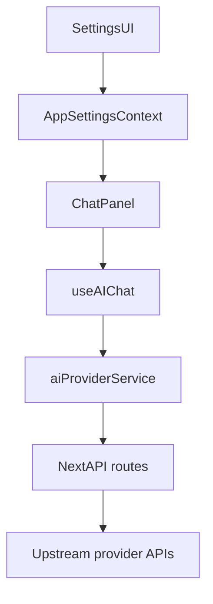

# AI Provider Architecture (FinTrace)

Tài liệu này mô tả kiến trúc AI trong FinTrace: provider/model, luồng Settings -> runtime chat, proxy API server-side, và cách mở rộng provider trong tương lai.

## Khái niệm

### Provider types

- Built-in providers: `openrouter`, `groq`, `huggingface`
  - Có thể dùng `platform/server key fallback` khi user không nhập key.
  - Proxy route cố định: `/api/openrouter/*`, `/api/groq/*`, `/api/huggingface/*`.
- Custom providers (OpenAI-compatible)
  - Cấu hình bởi user: `baseUrl` + `apiKey`.
  - Không có platform key fallback.
  - Proxy route: `/api/custom/*` và `baseUrl` truyền qua header để server thực hiện request upstream.

### Provider config shape (client)

Nguồn chính: `localStorage` key `ft-ai-providers` (hydrate bởi `AppSettingsContext`).

Field quan trọng:
- `id`: string (slug)
- `name`: string
- `enabled`: boolean
- `apiKey`: string (có thể rỗng)
- `baseUrl`: string (chỉ dùng cho custom providers)

## Luồng dữ liệu chính



## Settings: quản lý providers & default model

File chính:
- `src/app/settings/page.tsx`
- `src/context/AppSettingsContext.tsx`

Cơ chế:
- Settings cho phép add provider custom với `baseUrl` (OpenAI-compatible).
- Dropdown model defaults gọi `aiProviderService.getModels(providerId, apiKey, baseUrl)`.
- Nếu fetch models lỗi/401:
  - Built-in: UI dùng curated fallback list theo provider.
  - Custom: fallback list rỗng (không tự hiển thị OpenRouter models).

## Runtime chat

File chính:
- `src/components/ai/ChatPanel.tsx`
- `src/hooks/useAIChat.ts`
- `src/services/aiProviderService.ts`

Nguyên tắc:
- Chat chỉ cho gửi nếu provider đang `enabled` và `available` (có user key hoặc built-in platform key).
- Provider custom gửi qua `/api/custom/chat/completions` và bắt buộc có `Authorization: Bearer ...`.

## API proxy routes (server-side)

### Built-in
- `src/app/api/openrouter/*`
- `src/app/api/groq/*`
- `src/app/api/huggingface/*`

Đặc điểm:
- Extract user key từ header.
- Nếu thiếu user key: thử lấy platform/server key.
- Khi upstream lỗi: trả JSON lỗi chuẩn hóa (có `providerId`, `error`, `code`, `details`).

### Custom (OpenAI-compatible)
- `src/app/api/custom/models/route.ts`
- `src/app/api/custom/chat/completions/route.ts`

Đầu vào:
- `x-ai-provider-id`: providerId (để debug/hiển thị)
- `x-ai-provider-base-url`: baseUrl (bắt buộc)
- `authorization: Bearer <apiKey>` (bắt buộc)

An toàn:
- Validate baseUrl: chỉ `http/https`, chặn `localhost` và dải IP private phổ biến (chống SSRF cơ bản).

## Error model (chuẩn)

Các API route trả lỗi dạng:

```json
{
  "providerId": "openrouter|groq|huggingface|<custom-id>",
  "error": "Human readable message",
  "code": "MISSING_AUTH|UPSTREAM_ERROR|INVALID_BASE_URL|...",
  "details": "raw upstream body (optional)"
}
```

Client-side (`aiProviderService`) parse JSON lỗi và ném `AIProviderServiceError` để UI hiển thị đúng provider.

## Quy ước mở rộng provider

1) Nếu là built-in provider mới:
- Thêm API routes `/api/<provider>/(models|chat/completions)`.
- Đăng ký logic header/key tương ứng trong `aiProviderService`.
- Thêm curated fallback models trong `src/lib/aiModelDefaults.ts` nếu cần.

2) Nếu là custom OpenAI-compatible:
- Không cần thêm route mới (dùng `/api/custom/*`).
- Chỉ cần tạo provider config trong Settings với `baseUrl` đúng.

## Debug checklist

- Settings model list bị “lạc” provider:
  - Kiểm tra provider đó có `baseUrl` không (nếu custom).
  - Kiểm tra `getFallbackModelsForProvider(providerId)` có trả list rỗng cho provider custom.
- Chat vẫn chạy khi đã tắt provider:
  - Kiểm tra `enabled` và `availableProviders` trong context.
  - Chat input bị disable nếu không có provider hợp lệ.
- Lỗi hiển thị nhầm OpenRouter:
  - Kiểm tra request đang đi route nào (`/api/custom` vs `/api/openrouter`).
  - `aiProviderService` sẽ throw lỗi có prefix `[<providerId>] ...` theo provider thực tế.

